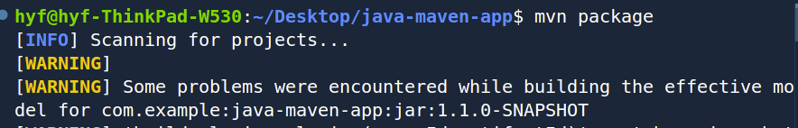

## Guide on how to install and run Nexus on a cloud server

# Step 1 

1. Create Ubuntu Server on DigitalOcean(Droplet) - min 4GB RAM, 2 CPUs, 160 GB SSD Disk
2. Open SSH port 22
3. Install Java 8
4. Download and Install Nexus
5. Create "nexus" user and group - Best Practice: Run applications with own user

# Step 2

- install Nexus on the cloud server created in step 1 above.
- command to install Nexus : 
    ### "wget https://download.sonatype.com/nexus/3/nexus-3.75.1-01-unix.tar.gz"

    .

# step 3

In order to comply with security best practices, avoid running nexus with the root user, rather create a nexus with user with permissions limited only to the Nexus service.

1.  make nexus own the folders: 

2. start Nexus with nexus-user

# step 4

- With Nexus up and running in the browser, initial configuration has to be done, logging in and creating a user with least privilege rules for artifact repository admin role.

- In this project I have published an artifact using the Maven tool.

- Prior to cloning and running various maven commands to publish the artifact, ensure you configure your nexus user credentials using 'vim' that will give access to nexus from your computer like below: 

- Clone the repository and go into the project folder, run the command:
    ### mvn package
This command will build the project and package the compiled code into a JAR (Java ARchive) file format, ready to be pushed to the nexus repository.

- After the build file has been successfully created, run the command:
    ### mvn deploy

this command, when executed will publish the JAR file to the nexus repository. 

